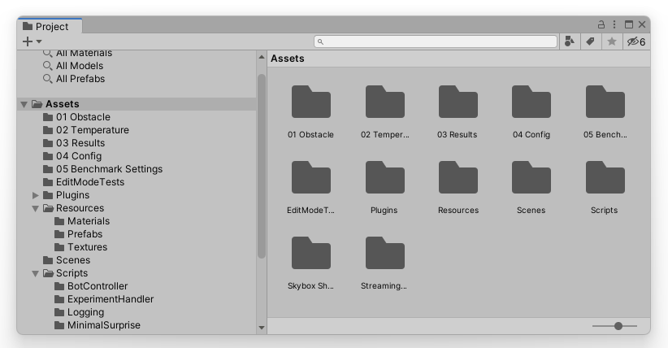
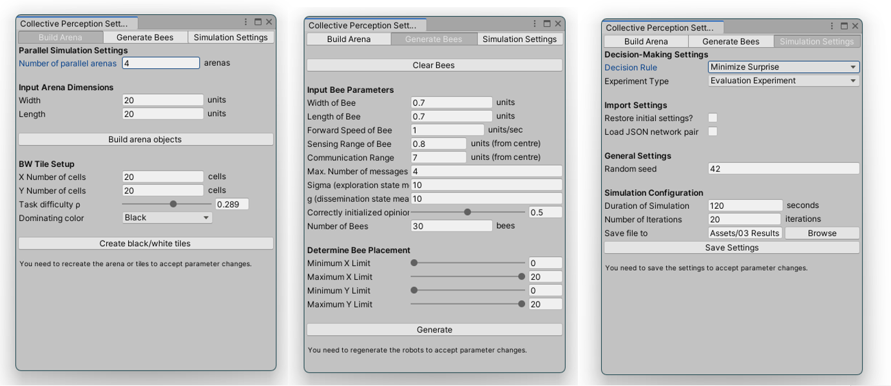
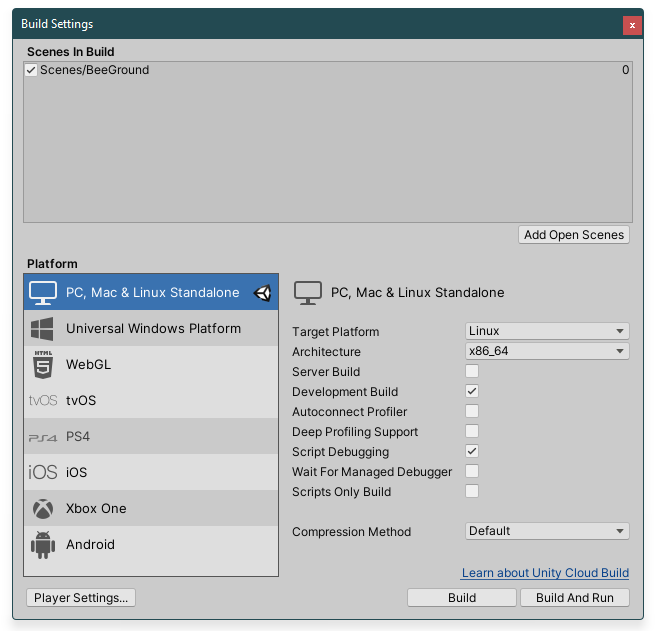

# Collective Perception 

contributors: Tristan Potten, Tanja Katharina Kaiser

## Credits

The code is based on BeeGround which is publicly available on [GitHub (`wshiyi-cn/BeeGround`)](https://github.com/wshiyi-cn/BeeGround) (accessed & cloned on 2020-05-04).

## Developer's Guide

The code was developed with **Unity version 2019.4.17.f1** which you can download from the [official Unity webpage](https://unity3d.com/de/get-unity/download) (via the Unity Hub - you might need a Unity account).

Unity offers a *Project* tab where all the resources and scripts are located:


The directory 📂`/Scripts/` contains all C# scripts that define the experiment setup as well as the robots' behavior. You can edit the corresponding files with an IDE or editor of your choosing. IntelliJ Rider works very well for C# as it also has a Unity integration.

### How to start the experiments...

#### ... directly from the Unity editor

> Use case: development and debugging. 

If no agents and arenas are shown when opening the project the first time, click on Scenes - BeeGround   

1. Configure the experiment with your desired parameters in the GUI: 

   1. In the top menu bar, click on *Tools* | *Collective Perception Settings*. This opens the custom GUI to set many of the experimental parameters:
      

   2. Configure the experiments as you wish.

      > ❗Note that in most of the configurator's tabs, you need to save the params or rebuild the arena, the bots, etc. to apply your changes to the experiments.

2. After configuring the parameters, simply click on the play button ▶️ at the top center of the editor's window. This start's the *Play mode*. 

In the *Play mode* you can use your keyboard's buttons:

* 1, 2, 3, etc. (for experiment speed adjustments)
* The arrows ⬅️➡️ to switch between arenas
* The escape button to exit the run

#### ... as a compiled build (independently from Unity)

> Use case: Running experiments on VMs

###### How universal is a build? Can I create one build and set all parameters via config files to be imported?

A build also stores all configuration parameters as set by the user (previously described). Some of these parameters can be overwritten (e.g., decision rule, task difficulties, simulation times). These parameters are only used **in** the experiments and not during experiment setup.

Other parameters can only be set in the Editor as described above (e.g., experiment type (evaluation vs. evolution), number of bots, arena size, tile numbers, etc.). These parameters are actually used **during experiment setup** (e.g., to create the bots or the arena, and the corresponding GameObjects). This logic can (at this time) only be handled by the configuration scripts that are triggered by the buttons in the custom configuration scripts in the Unity editor.

As a result of this, one might need to create multiple builds if experiments are desired for multiple values of the parameters that can only be set in the Unity editor. As an example: You would need multiple builds for different arena or swarm sizes. Or one build for the evolution mode and one for the evaluation mode.

###### How to build the project and execute experiments?

1. Build (& export) the project: Under `File` - `Build Settings`, select the target platform (Linux for most VMs) and setup the configuration check boxes (e.g., as in the screenshot). Then click `Build` and select a target directory.
   

2. Optional: Transfer the built project to the target machine of your choosing. In this example: `Linux`

3. Optional (might be needed depending on your setup) - make the built file executable with

   ```
   chmod +x ./your_build.x86_64
   ```

4. Setup the experiments you want to run by creating the corresponding config files:

   - Note that the previously created build stores all parameters as set in the Unity editor. There are some mechanisms to overwrite them by importing configuration files at start of the application (e.g., to execute experiments with partially deviating parameters).

   - These parameters to overwrite the build's default values are stored in yaml files in the directory 📂 `<your_build_name>_Data/StreamingAssets` (the files **have** to be in this directory, *not* the build's parent directory!). The yaml configuration file is passed as a commandline argument (just the file name, no need to specify the path to the `StreamingAssets` directory):

     ```
     ./your_build.x86_64 -params your_config_file.yaml
     ```

   - After starting a run, all imported values that overwrite the default values are printed to the console. This allows you to verify that your desired values are imported.
     *Example*:

     ```
     >> YAML IMPORT: Found a yaml settings file /home/user/Desktop/builds/ms_linux_eval/ms_linux_eval_Data/StreamingAssets/ms_hard_045.yaml and starting master import:
        Setting master.runID := Eval run - MS Hard Difficulty 045 - Increased simTime
        Setting master.simTime := 600
        Setting master.sequentialSimRounds := 1000
        Setting master.taskDifficulty := 0.45
        Setting master.decisionRule := MinimizeSurprise
        Setting master.loadInitialSettings := True
        Setting master.initialSettingsJsonPath := config/initial_settings_1k_045.json
        Setting master.loadNetworkJson := True
        Setting master.networkJsonPath := config/penalty_034_superlong.json
     ```

   - Exemplary config files can be found in the directory 📂`_config` of this repository. 

     - There are also sample files for the neural network (reuse evolved networks) and initial settings (redo experiments under identical conditions) import.
     - The neural network and initial settings report are specified within the configuration yaml file (see the example above).

5. Start your experiment (or create a simple shell script with multiple experiments and corresponding yaml config files):

   ```
   ./your_build.x86_64
   ```

   - Useful commandline arguments / flags ([Official Unity documentation ↩️](https://docs.unity3d.com/Manual/PlayerCommandLineArguments.html))

     - `-batchmode` flag: *Run the application in “headless” mode. In this mode, the application doesn’t display anything or accept user input*
     - `-nographics` flag: *When you use this argument in batch mode, Unity doesn’t initialize a graphics device.*  This enables a considerable speedup of the experiments (the time scale is automatically set to x150 or so)
     - `-params`  see above

   - We usually start runs with this setup:

     ```
     ./your_build.x86_64 -batchmode -nographics -params your_params.yaml
     ```

## Log Description

The following log types are produced:

* `_arena_settings.csv`: Which arena (of the multiple parallel arenas) used which start setting in which round, corresponding to which generation, individual ID, which evaluation run? Were the tiles inversed? *Just for evolutionary experiments* 
* `_evolution_history.json`: How did the fitness evolve over the course of evolution? *Just for evolutionary experiments*
  * The values inside the json have the following meaning:
    * `generationCounter`: generation counter
    * `bestFitness`: generation's best fitness value
    * `completeFitnessVals`: Complete array of fitness values for all individuals (sorted descending). Calculated according to the currently chosen fitness calculation scheme.
    * `completeEvalTuples`: Complete array of tuples used for fitness calculation (sorted as `completeFitnessVals`)
      * The tuples' items have this meaning:
        * `Item1`: Number of accesses to the ANN pair (needed for normalization)
        * `Item2`: Cumulated prediction error over all predictions
        * `Item3`: Percentage of correct opinions at the end of the evaluation

    * `completeFitnessIDs`: Complete array of ANN pair IDs (sorted as `completeFitnessVals`). 
      * The naming convention allows the retracing of networks parents' IDs by prefix matching. For example, `#45.0` is the first child of `#45`, `#45.1` is the second child of `#45` and so on.

    * `netsToStore`: Best performing networks serialized in json (ready for copy & paste & import into the Beeground framework)

* `_initial_settings.json`: Initial / start settings (i.e., robot positions, headings, opinion distributions, tile patterns) for experiment reproduction
* `_Parameters.txt`: Snapshot of global experiment parameters (basically in yaml format)
* `_neural_net_log.csv`: Log of inputs & outputs of each access to the networks. *Just for minize surprise experiments*
* `_PositionsOpinions.csv`: Log of bot positions and opinions, sampled every second.

> :exclamation: In **evolution experiments**, the last two log types (`neural_net_log`, `PositionOpinions`) tend to become very large due to the large number of performed evaluations. 
>
